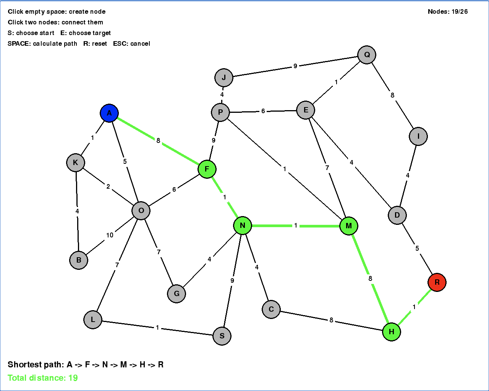

# Dijkstra's Game

An interactive browser-based graph visualisation game built with Python and Pygame.

The purpose of this project is to strengthen my understanding of Dijkstra’s shortest-path algorithm by applying it in a practical and visual environment. The project also gave me experience deploying a Python game as a web application using Pygbag and GitHub Pages.

## 🎮 Play the Game

[Play Dijkstra's Game in your browser](https://jacksonjgee.github.io/dijkstras_game/)



## Overview

Dijkstra's Game allows users to create their own weighted graph and calculate the shortest path between two selected nodes.

Users can:

* Create up to 26 nodes
* Connect nodes with randomly generated weighted edges
* Select a starting node
* Select a target node
* Run Dijkstra’s algorithm
* View the shortest path and its total distance

The calculated shortest path is highlighted in green, making it easier to understand how the algorithm moves through a weighted graph.

## Controls

| Action                       | Control                      |
| ---------------------------- | ---------------------------- |
| Create a node                | Left-click on empty space    |
| Connect two nodes            | Click one node, then another |
| Select the starting node     | Press `S`, then click a node |
| Select the target node       | Press `E`, then click a node |
| Calculate the shortest path  | Press `SPACE`                |
| Cancel the current selection | Press `ESC`                  |
| Reset the graph              | Press `R`                    |

## How It Works

The game represents the graph using an adjacency-list data structure.

Each node stores its neighbouring nodes and the weight of each connection. When the player requests a shortest path, Dijkstra’s algorithm uses a custom minimum heap priority queue to process the node with the smallest known distance.

The algorithm returns:

* The shortest known distance to each node
* The previous node used to reach each destination
* The final shortest path from the selected start node to the target node

## Project Structure

```text
dijkstras_game/
├── main.py
├── src/
│   ├── __init__.py
│   ├── game.py
│   ├── graph.py
│   ├── dijkstra.py
│   └── heap_priority_queue.py
├── images/
│   └── image.png
├── requirements.txt
└── README.md
```

### File responsibilities

* `main.py` starts the application.
* `game.py` handles Pygame rendering, input and game state.
* `graph.py` stores nodes, edges and weights.
* `dijkstra.py` contains the shortest-path algorithm.
* `heap_priority_queue.py` contains the custom minimum heap implementation.

## Technologies Used

* Python
* Pygame
* Pygbag
* GitHub Pages
* GitHub Actions

## Learning Outcomes

Through this project, I developed a stronger understanding of:

* Dijkstra’s shortest-path algorithm
* Graph data structures
* Adjacency lists
* Minimum heap priority queues
* Object-oriented Python
* Event-driven programming with Pygame
* Browser deployment using Pygbag
* Automated deployment using GitHub Actions and GitHub Pages
